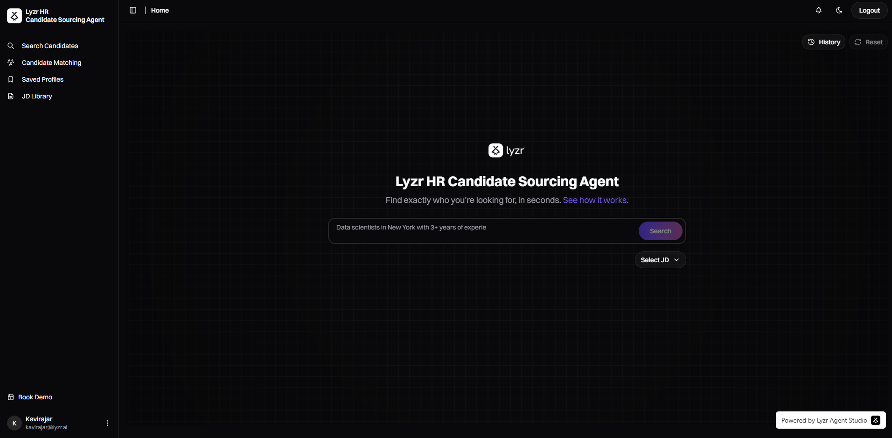
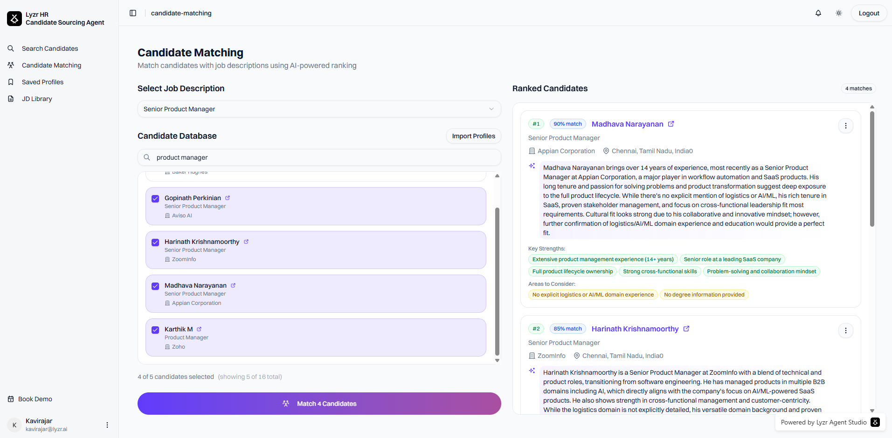

# Lyzr HR Candidate Sourcing Agent

An AI-powered web application that revolutionizes talent sourcing for HR professionals and recruiters. Built with Next.js and powered by Lyzr AI agents, this platform provides intelligent candidate search, evaluation, and management capabilities.

<!-- > **Note**: This is a simplified, open-source version for learning and experimentation. For enterprise-grade features, custom integrations, and production support, [contact Lyzr](https://www.lyzr.ai/) to build a tailored solution for your organization. -->

## Screenshots

<!-- Add screenshots here to showcase your application -->
<!-- Recommended: Add images to a /public/screenshots/ folder and reference them like this: -->
 
<!--  -->


## What It Does

This application helps streamline the recruitment process through:

### Core Features

**AI-Powered Candidate Search**
- Natural language queries to find candidates on LinkedIn
- Intelligent filtering by job titles, companies, locations, and skills
- Real-time streaming results with AI-powered summaries

**Candidate Matching & Evaluation**
- Upload job descriptions and get AI-powered candidate rankings
- Automated scoring based on profile relevance and experience match
- Detailed rationale for each candidate recommendation

**Profile Management**
- Save and organize candidate profiles for future reference
- Group profiles by search sessions for better organization
- Quick access to candidate details and LinkedIn profiles

**Job Description Library**
- Create, edit, and manage job descriptions
- Attach JDs to candidate searches for better matching
- Centralized storage for consistent hiring criteria

### Technical Highlights

- **AI Agents**: Specialized Lyzr agents for sourcing and matching tasks
- **Real-time Updates**: Server-sent events for streaming AI responses
- **Modern UI**: Responsive design with shadcn/ui components
- **Type Safety**: Full TypeScript implementation
- **Database**: MongoDB with Mongoose ODM for data persistence

## Tech Stack

### Frontend
- **Next.js 14+** - React framework with App Router
- **TypeScript** - Type-safe development
- **Tailwind CSS** - Utility-first styling
- **shadcn/ui** - High-quality UI components
- **Radix UI** - Accessible component primitives
- **Lucide React** - Icon library

### Backend
- **Next.js API Routes** - Serverless API endpoints
- **MongoDB** - NoSQL database
- **Mongoose** - MongoDB ODM
- **Server-Sent Events (SSE)** - Real-time streaming

### AI & APIs
- **Lyzr AI** - AI agent framework for intelligent candidate sourcing
- **RapidAPI (LinkedIn Data)** - Candidate profile enrichment

### Authentication
- **Lyzr/Memberstack** - User authentication and management

## Self-Hosting Instructions

### Prerequisites

- Node.js 18+
- MongoDB database
- Lyzr AI account and API credentials
- LinkedIn data API access (RapidAPI)

### Environment Variables

Create a `.env` file in the project root based on `.env.example`:

```bash
cp .env.example .env
```

Then fill in your actual values:

```env
# MongoDB connection string
MONGODB_URI=your_mongodb_connection_string_here

# Encryption key for sensitive data (use a long, random string)
ENCRYPTION_KEY=your_encryption_key_here

# Public app URL (used for metadata and redirects)
NEXT_PUBLIC_APP_URL=http://localhost:3000

# RapidAPI configuration for LinkedIn data
RAPID_API_BASE=fresh-linkedin-profile-data.p.rapidapi.com
RAPID_API_KEY=your_rapidapi_key_here

# API authentication token (server-side)
API_AUTH_TOKEN=your_api_auth_token_here

# API authentication token (client-side, must be prefixed with NEXT_PUBLIC_)
NEXT_PUBLIC_API_AUTH_TOKEN=your_api_auth_token_here

# Google Site Verification (optional, for SEO)
GOOGLE_SITE_VERIFICATION=your_google_verification_code_here
```

**Required API Keys:**
- **MongoDB URI**: Get a free database at [MongoDB Atlas](https://www.mongodb.com/cloud/atlas)
- **RapidAPI Key**: Sign up at [RapidAPI](https://rapidapi.com/) and subscribe to "Fresh LinkedIn Profile Data"
- **API Auth Token**: Generate a secure random token (e.g., using `openssl rand -hex 32`)
- **Encryption Key**: Generate a secure random key (minimum 32 characters)

### Installation

1. **Clone the repository**
   ```bash
   git clone <repository-url>
   cd lyzr-hr-candidate-sourcing
   ```

2. **Install dependencies**
   ```bash
   npm install
   ```

3. **Set up the database**
   - Ensure MongoDB is running locally or update `MONGODB_URI` for your database
   - The application will automatically create required collections on first run

4. **Start the development server**
   ```bash
   npm run dev
   ```

5. **Access the application**
   Open [http://localhost:3000](http://localhost:3000) in your browser

### Production Deployment

For production deployment:

1. **Build the application**
   ```bash
   npm run build
   ```

2. **Start the production server**
   ```bash
   npm start
   ```

3. **Set up a reverse proxy** (nginx, Apache, or similar) to handle SSL termination and routing

4. **Configure environment variables** for your production environment

### API Dependencies

The application requires:
- **LinkedIn API**: For candidate profile data (via RapidAPI)
- **MongoDB**: For data persistence

Ensure all API keys and credentials are properly configured before running the application.

## Getting Started

Once running, the application provides a clean interface for:

1. **Searching candidates** using natural language queries
2. **Managing job descriptions** in the JD Library
3. **Saving and organizing** candidate profiles
4. **Matching candidates** against job requirements

The AI agents will guide you through the process, making candidate sourcing more efficient and effective.

## Contributing

We welcome contributions from the community! Whether it's bug fixes, new features, documentation improvements, or suggestions, your input is valuable.

Please see [CONTRIBUTING.md](./CONTRIBUTING.md) for detailed guidelines on how to contribute to this project.

## Support

For questions, issues, or feature requests:

1. **Open Source Community**: Open an issue in this repository for bugs or feature requests
2. **Enterprise Solutions**: For custom integrations, advanced features, and production support, [contact Lyzr](https://www.lyzr.ai/)

## License

This project is licensed under the MIT License - see the [LICENSE](./LICENSE) file for details.

## Acknowledgments

- Built with [Lyzr AI](https://www.lyzr.ai/) - AI agent framework
- UI components from [shadcn/ui](https://ui.shadcn.com/)
- LinkedIn data via [RapidAPI](fresh-linkedin-profile-data.p.rapidapi.com)

---

**Need a custom solution?** This open-source version provides core functionality for learning and experimentation. For production-ready deployments with enterprise features, custom integrations, and dedicated support, [reach out to Lyzr](https://www.lyzr.ai/).
